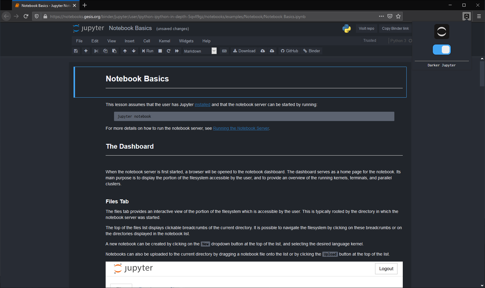

  
   
  v1.0

# Darker Jupyter
> Dark Mode for Jupyter Notebooks

Darker Jupyter is a browser extension that restyles Jupyter Notebooks to a darker theme.

Features:
- Changes the theme of Jupyter Notebooks (both offline and online) to a darker theme
- Popup Menu that enables you to toggle between dark mode and the original theme

# Installation
| Supported Browsers | Download Link |
| --- | --- |
| Mozilla Firefox | https://addons.mozilla.org/en-US/firefox/addon/darker-jupyter/ |

Note: The extension doesn't support Google Chrome as of the moment.

# Usage
Install the extension and it will automatically restyles your jupyter notebooks.

# Future Plans
- porting famous themes like Darcula, Material, Solarized, Monokai, etc... into the extension

# License
[MIT](LICENSE)
